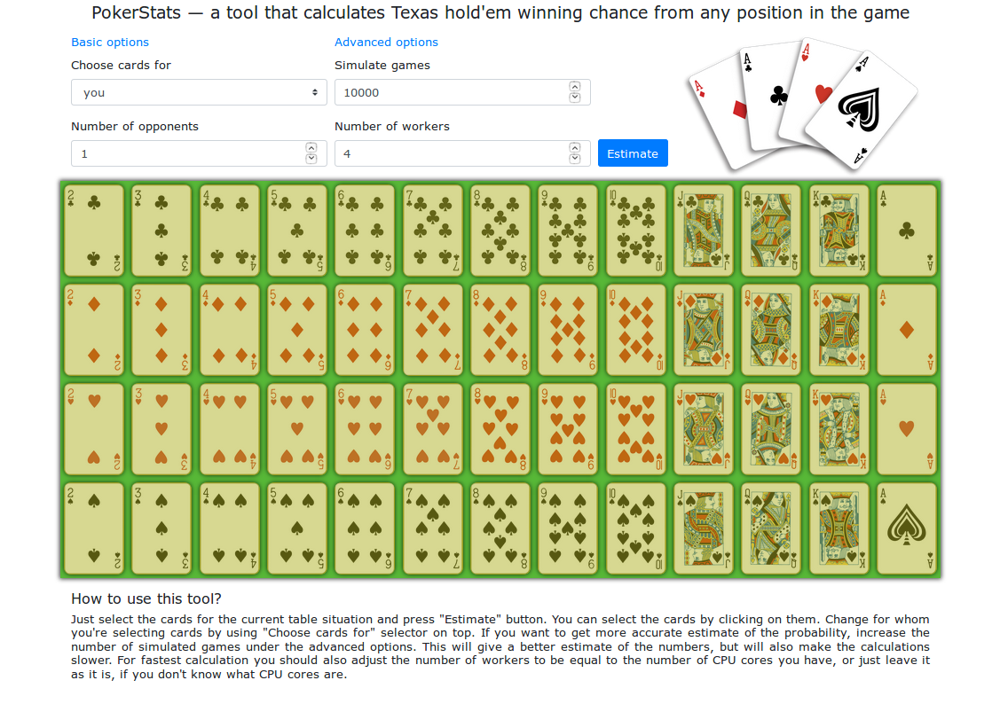
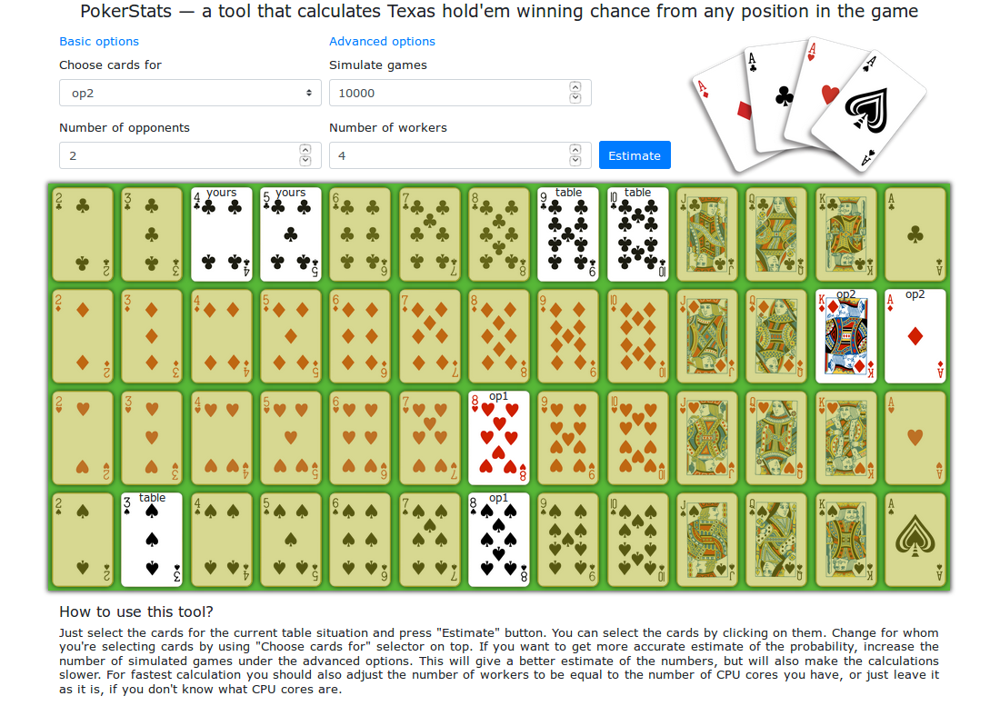
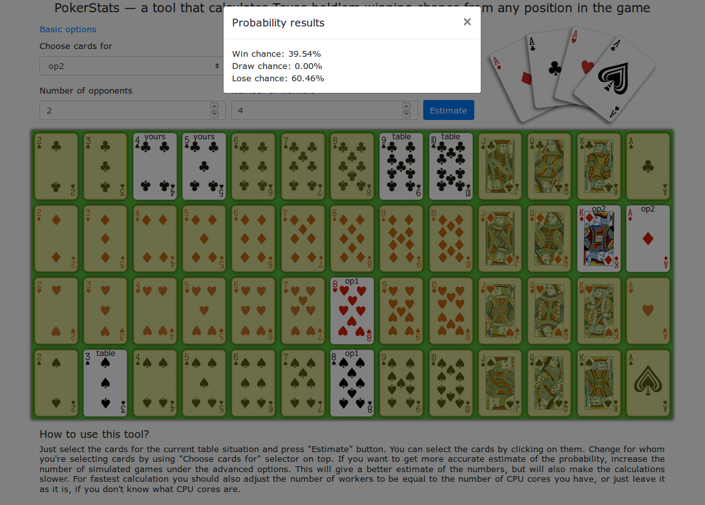

# PokerStats Website

This website allows you to calculate Texas hold'em winning probabilities for different game situations. It is built using [Bootstrap](https://getbootstrap.com/), [JQuery](https://jquery.com/) and [pokersolver](https://github.com/goldfire/pokersolver) packages. PokerStats should be reasonably fast and look good on desktops, tablets and mobile devices of all sizes and compute capabilities.

## Usage
Since the website does not have any server part (all calculations are pure javascript), you can clone it to your own computer and use it locally. Or you can access it at https://pokerstats.igitman.com. The series of screenshots presented in the end of the page should give you a good idea of the PokerStats functionality.

## How probabilities are calculated
To calculate winning probabilities we use [Monte Carlo methods](https://en.wikipedia.org/wiki/Monte_Carlo_method), which basically means that poker game is simulated randomly from the starting position many times and an average number of wins is used as winning probability. To speed-up calculations, the simulation is run in parallel using Javascript Web Workers API.

## PokerStats functionality
Basic website look: 

You can select cards for you, your opponents and table to completely specify game position. You can also choose number of games to simulate and number of parallel workers to carry out all computations:

After clicking "Estimate" button you will get the resulting probabilities:

Hopefully you will enjoy playing with this tool and will find it useful!
